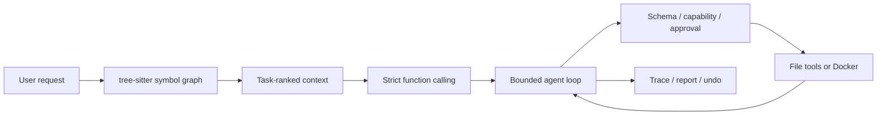

# pico

[](https://github.com/goskiwi/pico-main/actions/workflows/ci.yml)

**一个突出上下文选择、执行边界和可恢复性的本地 Coding Agent Runtime。**

[架构](docs/architecture/agent-harness-v1-overview.md) ·
[安全模型](docs/security-model.md) ·
[评测证据](docs/metrics/README.md) ·
[90 秒真实 OSS Demo](docs/demo-script.md) ·
[审阅入口](docs/review-pack/README.md)

`pico` 把模型输出收敛为有界的 `tool / final / retry` 状态转换。工具调用经过
Pydantic 参数校验、capability 检查、审批和 Docker 隔离后执行；每次运行都会落盘
task state、trace、workspace diff、Undo 前像和最终报告。

项目刻意只突出四件事：

1. **任务相关上下文**：真实 tokenizer 预算下，Repo Map、工作记忆和 Qdrant 语义检索只注入
   当前任务需要的内容；Markdown 是记忆的唯一事实来源。
2. **连续而可恢复的 Agent 循环**：Responses 原生 tool result 留在 provider 会话内；明确的
   上下文溢出才会触发一次有界恢复，不用摘要覆盖原始证据。
3. **强制执行边界与 Run Undo**：shell 只能进入无网络、只读 RootFS、资源受限的 Docker 容器；
   修改记录首触前像，冲突时整次拒绝恢复，不改写 Git。
4. **可审计的任务过程**：task canvas 是导航与恢复控制面，完整工具输出、trace、报告和隐藏
   verifier 共同保留可复核证据。

> 边界：这是本地单用户实验型 runtime，不是多租户生产平台；仓库微基准用于工程回归，
> 不代表通用 coding 能力。

## 已验证结果

| 场景 | 真实模型结果 | 结论 |
|---|---:|---|
| V4 多文件、跨模块、含干扰实现的 Repo Map A/B | `full` 13/15，`no_repo_map` 6/15 | Repo Map 在目标场景中明显提高任务成功率 |
| V5 Repo Map 预算决策 | 动态预算与 600-token cap 均 14/15 | 成本仅下降 3.36%，未过预注册 5% 阈值，保留动态默认 |
| 精简运行时审计状态后的 V5 回归 | clean worktree 三轮 `full` 均 5/5，共 15/15 | 删除重复 session history 后未引入真实任务回归 |
| Repo Map + Undo 可靠性回归 | 定位 3/3，Undo 6/6，完整 digest 恢复 6/6 | 检索和恢复链路可以一起工作 |
| pytest 输出与停滞反馈 A/B | candidate 6/6，baseline 2/6 | 更可用的失败尾部和进度信号提高了恢复成功率 |
| 冻结真实 OSS V1 外部复核（1×） | `full` 3/3，`no_repo_map` 3/3；平均工具步 12.33 vs 19.00 | 真实上游任务在两变体下都可复现完成；单次三题不能推断成功率或时延优势 |

完整报告和原始 JSON 入口见 [metrics evidence map](docs/metrics/README.md)。



## 5 分钟运行

需要 macOS/Linux（POSIX）、Python 3.10+、[`uv`](https://docs.astral.sh/uv/) 和 Docker。模型端点必须支持
OpenAI-compatible Responses API。

```bash
git clone https://github.com/goskiwi/pico-main.git
cd pico-main
uv sync --locked
docker build -f Dockerfile.sandbox -t pico-sandbox:latest .
```

在目标仓库创建 `.env.local`：

```dotenv
OPENAI_API_KEY=your-api-key
OPENAI_MODEL=gpt-5.4
# 可选：
# OPENAI_API_BASE=https://your-api.example/v1
# PICO_SECRET_ENV_NAMES=MY_EXTRA_SECRET
```

执行 one-shot 任务：

```bash
uv run pico --cwd /path/to/target-repo \
  --verify-cmd 'PYTHONPATH=src python -m pytest -q' \
  "inspect the failing tests, patch the smallest safe fix, and verify it"
```

也可以进入交互模式：

```bash
uv run pico --cwd /path/to/target-repo
```

常用命令：`/help`、`/memory`、`/session`、`/reset`、`/reload-skills`、`/exit`。

## 显式运行时验证

Pico 不猜测项目的测试命令。用 `--verify-cmd` 显式指定后，只要本次任务实际修改了
工作区，模型第一次调用 `submit_final` 时，runtime 会在同一个 Docker sandbox 中自行执行该
命令。它不依赖模型声称“测试已通过”，也不受模型工具审批流影响；命令由启动 Pico 的用户
显式提供。

- 命令通过：任务以 runtime 记录的验证结果完成；
- 命令失败：失败输出会回灌给同一模型会话，并仅允许一次最小修复；
- 修复后的第二次失败：任务以 `verification_failed` 结束，报告会保留两次验证记录；
- 未提供 `--verify-cmd`：不执行运行时验证。

验证记录写入 `.pico/runs/<run_id>/trace.jsonl` 和 `report.json` 的
`runtime_verifications` 字段。基准应把首次通过和一次修复后通过分开报告，不能把两者混为
同一个成功率。

## Repo Map

`RepoMap` 增量解析 Python 代码中的模块、类、函数、方法和签名，并构建以下关系：

- import 与 re-export；
- 函数/方法调用；
- 类继承；
- 模块、类和内部定义的包含关系；
- 测试函数与被测符号的名称关联。

当前请求中的标识符、文件路径和测试意图会形成 PageRank personalization vector。排序结果再结合
词法命中和文件多样性，避免大文件占满预算。

Repo Map 有两条入口：

- 每轮 prompt 自动获得一份受预算限制的相关签名地图；
- 模型可调用只读的 `query_repo_map` 对新子问题重新排序。

```bash
uv run pico --cwd /path/to/target-repo --repo-map-budget 600
```

当前实现有意只支持 Python，并依赖 tree-sitter；没有 AST/正则降级路径。算法与限制见
[Repo Map architecture](docs/architecture/repo-map.md)。

## 工具与安全边界

Pydantic model 是工具参数的唯一 schema 来源，同时用于：

- 本地参数校验；
- prompt 中的工具签名；
- OpenAI Responses strict function schema；
- tool signature 与 checkpoint identity。

高风险动作受 `--approval ask|auto|never` 控制。`run_shell` 还会先拦截递归强删、
`git reset --hard`、强制 `git clean`、`curl | sh`、写块设备等危险命令。

Shell 的执行链路是：

```text
参数校验
  -> 危险命令硬拦截
  -> capability / read-only / approval
  -> 环境变量过滤
  -> Docker 无网络 + 只读 RootFS + capability drop + 资源限制
  -> workspace diff
  -> undo journal
  -> trace/report
```

Docker 不可用、镜像不存在或命令超时时，任务明确失败，不会在宿主机继续执行。完整信任边界见
[security model](docs/security-model.md)。

## Run Undo

写文件、patch 或 shell 执行前，runtime 会记录候选路径的首触前像；工具结束后只保留实际变化
路径，并记录本次运行结束时的预期状态。

先预检：

```bash
uv run pico undo --cwd /path/to/target-repo \
  --run run_20260724-120000-abcdef \
  --dry-run
```

确认后恢复：

```bash
uv run pico undo --cwd /path/to/target-repo \
  --run run_20260724-120000-abcdef
```

只要任一路径在 Agent 结束后又被修改，整次 Undo 都会拒绝，不会恢复一半。它恢复的是运行开始
前的真实工作区内容，包括用户原有的未提交修改；不会创建自动 commit，也不会改写 Git index、
分支或提交。设计见 [Run undo architecture](docs/architecture/run-undo.md)。

## 运行工件

每次 `ask()` 会写入：

```text
.pico/runs/<run_id>/
├── task_state.json
├── trace.jsonl
├── task.mmd
├── offload.jsonl
├── phases/
│   ├── index.json
│   └── phase_001.mmd
├── report.json
├── undo/
│   ├── manifest.json
│   └── blobs/
└── refs/
```

上下文按四层持久化：`refs/*.txt` 保存完整证据，`offload.jsonl` 保存工具级摘要和
引用，`task.mmd` 保存活动任务画布，`index.json` 保存跨任务入口。预算使用模型对应的
`tiktoken` 编码（未知的兼容模型会明确记录 `o200k_base` 回退），不再使用字符估算。
主画布达到 12 个活动节点或 2800 token 后，较早步骤会折叠到 `phases/phase_XXX.mmd`；
通过 `read_task_canvas(phase_id="phase_001")` 可下钻查看。画布是前端展示、审计、恢复与
证据导航的控制平面；它不会替代任务内的即时上下文。模型在任务首轮收到轻量任务状态，
随后持续接收与函数调用匹配的原始 `tool_result`。只有 provider 明确报上下文超限时，运行时
才会新开一次会话，并在真实 tokenizer 预算内注入最近工具证据和当前文件快照；再次超限会
透明地停止，而不是反复压缩丢失细节。

可以把最新运行渲染为静态审计页面：

```bash
uv run python scripts/render_run_report.py .pico/runs --latest
```

生成的 `report.html` 会在浏览器中用 Mermaid 渲染当前画布，并把折叠阶段显示为可展开的
子画布；首次渲染需要能访问 Mermaid CDN，离线时仍会保留 Mermaid 源码。

## 语义长期记忆（可选 Qdrant）

稳定的 `user`、`feedback`、`project`、`reference` 记忆以 `.pico/memory/` 中的 Markdown
为事实源。配置 Qdrant 与 embedding 服务后，Pico 会把这些记忆增量镜像为外部向量，并把
Qdrant 语义排名与本地标签/关键词排名用 RRF 融合；代码、文件摘要、工具输出和任务工件
不会进入向量库。

项目根目录的 `docker-compose.yml` 已包含本地 Qdrant。它只监听 `127.0.0.1:6333`，数据放在
Docker 命名卷 `qdrant_storage` 中；启动后也可在 <http://localhost:6333/dashboard> 查看集合：

```bash
docker compose up -d qdrant
docker compose ps
```

复制示例配置到工作区 `.env.local`，再填入 embedding 服务的 Key：

```bash
cp .env.example .env.local
```

本地容器不需要 Qdrant API Key，保留 `PICO_QDRANT_API_KEY` 为空即可：

```dotenv
PICO_QDRANT_URL=http://localhost:6333
PICO_QDRANT_API_KEY=
PICO_QDRANT_COLLECTION=pico_memory
PICO_EMBEDDINGS_BASE_URL=https://dashscope.aliyuncs.com/compatible-mode/v1
PICO_EMBEDDINGS_API_KEY=<DASHSCOPE_API_KEY>
PICO_EMBEDDINGS_MODEL=text-embedding-v4
PICO_EMBEDDINGS_DIMENSION=1024
```

已有 Markdown 记忆可显式建立首次索引；日后的 durable-memory 写入会自动增量同步：

```bash
uv run pico memory-sync --cwd /path/to/target-repo
```

示例与 Glodex 当前环境对齐：它复用 `DASHSCOPE_API_KEY`，使用 DashScope OpenAI-compatible
API 的 `text-embedding-v4`（1024 维）。`PICO_EMBEDDINGS_DIMENSION` 会原样传给 embedding
接口；Qdrant 则在首次同步时以实际返回向量维度建 collection。若改用受保护的自托管实例或
Qdrant Cloud，只需将 `PICO_QDRANT_URL` 和 `PICO_QDRANT_API_KEY` 换成对应值。
`docker compose down` 会停止服务但保留记忆；只有 `docker compose down -v` 才会删除本地
Qdrant 数据卷。

## 本地 Skills

项目的可选工作流保存在 `.pico/skills/<name>/SKILL.md`，并与源码一起提交。当前包含
调试、测试先行、代码审查、运行时不变量变更、运行工件审计和安全/Undo 审查。审查类 skills
通过 `allowed_tools_strict` 只暴露读取与审计工具；它们只能收缩能力，不能绕过 Pico 的本地
校验、审批和 Docker sandbox。

## 代码入口

| 模块 | 职责 |
|---|---|
| `pico/agent_loop.py` | 有界模型—工具循环与停止状态 |
| `pico/runtime.py` | Agent 组合、prompt prefix 与运行生命周期 |
| `pico/context_manager.py` | tokenizer 预算、Repo Map、记忆和恢复上下文的组装 |
| `pico/models.py` | 原生 Responses 会话与 function-call output 回放 |
| `pico/repo_map.py` | tree-sitter、符号图、PageRank 与预算渲染 |
| `pico/semantic_memory.py` | Qdrant 向量镜像与混合召回 |
| `pico/tools.py` | 工具 schema、校验和执行 |
| `pico/sandbox.py` | 强制 Docker shell 边界 |
| `pico/run_undo.py` | 前像、冲突预检和恢复 |
| `pico/run_store.py` | trace、报告、任务画布分阶段归档和完整工具输出 |
| `evaluation/real_benchmark.py` | 真实模型 fixture、隐藏 verifier 与证据采集 |

10–15 分钟代码审阅顺序见 [review pack](docs/review-pack/README.md)。

## 评测与开发

默认真实模型评测使用 V5 多模块 fixture，输出写到被忽略的 `artifacts/` 本地路径：

```bash
uv run python scripts/run_real_world_benchmark.py \
  --variant full \
  --repetitions 3 \
  --require-clean-worktree
```

Repo Map A/B：

```bash
uv run python scripts/run_real_world_benchmark.py \
  --benchmark-path benchmarks/real_world_tasks_v4.json \
  --variant full \
  --variant no_repo_map \
  --repetitions 3 \
  --require-clean-worktree
```

冻结真实 OSS 的外部复核使用十个独立 Python 仓库；历史三任务 smoke 仍保留为
[Real OSS V1](docs/benchmarks/real-oss-v1.md)：

```bash
uv run python scripts/materialize_real_oss_v1.py \
  --manifest benchmarks/real_oss_v2.json \
  --replace
docker build -f Dockerfile.real-oss-v2 -t pico-real-oss-v2:latest .
uv run python scripts/run_real_world_benchmark.py \
  --benchmark-path benchmarks/real_oss_v2.json \
  --sandbox-image pico-real-oss-v2:latest \
  --variant full \
  --variant no_repo_map \
  --repetitions 1 \
  --require-clean-worktree
```

任务来源、快照和解释边界见 [Real OSS V2 protocol](docs/benchmarks/real-oss-v2.md)。

面试用的单任务、真实 OSS 演示入口和逐秒讲稿见 [90 秒真实 OSS Demo](docs/demo-script.md)：

```bash
uv run python scripts/run_real_oss_v1_demo.py
```

离线质量门禁：

```bash
uv run ruff check .
uv run pytest -q
uv run python -m compileall -q pico tests scripts
uv build
```

Docker integration 和真实 LLM 测试单独运行；默认 pytest 不发送模型请求。
