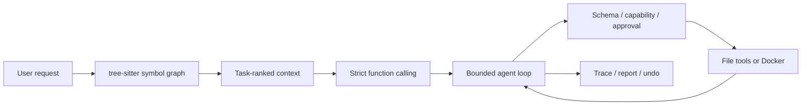

# pico

[](https://github.com/goskiwi/pico-main/actions/workflows/ci.yml)

**一个突出检索、执行边界和可恢复性的本地 Coding Agent Runtime。**

[架构](docs/architecture/agent-harness-v1-overview.md) ·
[安全模型](docs/security-model.md) ·
[评测证据](docs/metrics/README.md) ·
[审阅入口](docs/review-pack/README.md)

`pico` 把模型输出收敛为有界的 `tool / final / retry` 状态转换。工具调用经过
Pydantic 参数校验、capability 检查、审批和 Docker 隔离后执行；每次运行都会落盘
task state、trace、workspace diff、Undo 前像和最终报告。

项目刻意只突出四件事：

1. **Task-aware Repo Map**：tree-sitter 建符号图，Personalized PageRank 按当前任务排序，
   只把相关签名放进上下文。
2. **强制执行边界**：shell 只能进入无网络、只读 RootFS、资源受限的 Docker 容器，
   不回退到宿主机。
3. **Run Undo 与审计**：记录文件首触前像和运行后状态，冲突时整次拒绝恢复，不改写 Git。
4. **可验证的 Agent 循环**：隐藏 verifier、冻结快照和真实模型 A/B 用来决定改动是否保留。

> 边界：这是本地单用户实验型 runtime，不是多租户生产平台；仓库微基准用于工程回归，
> 不代表通用 coding 能力。

## 已验证结果

| 场景 | 真实模型结果 | 结论 |
|---|---:|---|
| V4 多文件、跨模块、含干扰实现的 Repo Map A/B | `full` 13/15，`no_repo_map` 6/15 | Repo Map 在目标场景中明显提高任务成功率 |
| V5 Repo Map 预算决策 | 动态预算与 600-token cap 均 14/15 | 成本仅下降 3.36%，未过预注册 5% 阈值，保留动态默认 |
| Repo Map + Undo 可靠性回归 | 定位 3/3，Undo 6/6，完整 digest 恢复 6/6 | 检索和恢复链路可以一起工作 |
| pytest 输出与停滞反馈 A/B | candidate 6/6，baseline 2/6 | 更可用的失败尾部和进度信号提高了恢复成功率 |

完整报告和原始 JSON 入口见 [metrics evidence map](docs/metrics/README.md)。



## 5 分钟运行

需要 macOS/Linux（POSIX）、Python 3.10+、[`uv`](https://docs.astral.sh/uv/) 和 Docker。模型端点必须支持
OpenAI-compatible Responses API。

```bash
git clone https://github.com/goskiwi/pico-main.git
cd pico-main
uv sync --locked
docker build -f Dockerfile.sandbox -t pico-sandbox:latest .
```

在目标仓库创建 `.env.local`：

```dotenv
OPENAI_API_KEY=your-api-key
OPENAI_MODEL=gpt-5.4
# 可选：
# OPENAI_API_BASE=https://your-api.example/v1
# PICO_SECRET_ENV_NAMES=MY_EXTRA_SECRET
```

执行 one-shot 任务：

```bash
uv run pico --cwd /path/to/target-repo \
  "inspect the failing tests, patch the smallest safe fix, and verify it"
```

也可以进入交互模式：

```bash
uv run pico --cwd /path/to/target-repo
```

常用命令：`/help`、`/memory`、`/session`、`/reset`、`/reload-skills`、`/exit`。

## Repo Map

`RepoMap` 增量解析 Python 代码中的模块、类、函数、方法和签名，并构建以下关系：

- import 与 re-export；
- 函数/方法调用；
- 类继承；
- 模块、类和内部定义的包含关系；
- 测试函数与被测符号的名称关联。

当前请求中的标识符、文件路径和测试意图会形成 PageRank personalization vector。排序结果再结合
词法命中和文件多样性，避免大文件占满预算。

Repo Map 有两条入口：

- 每轮 prompt 自动获得一份受预算限制的相关签名地图；
- 模型可调用只读的 `query_repo_map` 对新子问题重新排序。

```bash
uv run pico --cwd /path/to/target-repo --repo-map-budget 600
```

当前实现有意只支持 Python，并依赖 tree-sitter；没有 AST/正则降级路径。算法与限制见
[Repo Map architecture](docs/architecture/repo-map.md)。

## 工具与安全边界

Pydantic model 是工具参数的唯一 schema 来源，同时用于：

- 本地参数校验；
- prompt 中的工具签名；
- OpenAI Responses strict function schema；
- tool signature 与 checkpoint identity。

高风险动作受 `--approval ask|auto|never` 控制。`run_shell` 还会先拦截递归强删、
`git reset --hard`、强制 `git clean`、`curl | sh`、写块设备等危险命令。

Shell 的执行链路是：

```text
参数校验
  -> 危险命令硬拦截
  -> capability / read-only / approval
  -> 环境变量过滤
  -> Docker 无网络 + 只读 RootFS + capability drop + 资源限制
  -> workspace diff
  -> undo journal
  -> trace/report
```

Docker 不可用、镜像不存在或命令超时时，任务明确失败，不会在宿主机继续执行。完整信任边界见
[security model](docs/security-model.md)。

## Run Undo

写文件、patch 或 shell 执行前，runtime 会记录候选路径的首触前像；工具结束后只保留实际变化
路径，并记录本次运行结束时的预期状态。

先预检：

```bash
uv run pico undo --cwd /path/to/target-repo \
  --run run_20260724-120000-abcdef \
  --dry-run
```

确认后恢复：

```bash
uv run pico undo --cwd /path/to/target-repo \
  --run run_20260724-120000-abcdef
```

只要任一路径在 Agent 结束后又被修改，整次 Undo 都会拒绝，不会恢复一半。它恢复的是运行开始
前的真实工作区内容，包括用户原有的未提交修改；不会创建自动 commit，也不会改写 Git index、
分支或提交。设计见 [Run undo architecture](docs/architecture/run-undo.md)。

## 运行工件

每次 `ask()` 会写入：

```text
.pico/runs/<run_id>/
├── task_state.json
├── trace.jsonl
├── task_graph.mmd
├── report.json
├── undo/
│   ├── manifest.json
│   └── blobs/
└── tool_outputs/
```

完整工具输出保存在 `tool_outputs/`，history 只保留摘要和引用；模型需要回看时通过
`read_tool_output` 按任务图节点读取，避免把大段 pytest 输出反复塞回上下文。

可以把最新运行渲染为静态审计页面：

```bash
uv run python scripts/render_run_report.py .pico/runs --latest
```

## 代码入口

| 模块 | 职责 |
|---|---|
| `pico/agent_loop.py` | 有界模型—工具循环与停止状态 |
| `pico/runtime.py` | Agent 组合、prompt prefix 与运行生命周期 |
| `pico/repo_map.py` | tree-sitter、符号图、PageRank 与预算渲染 |
| `pico/tools.py` | 工具 schema、校验和执行 |
| `pico/sandbox.py` | 强制 Docker shell 边界 |
| `pico/run_undo.py` | 前像、冲突预检和恢复 |
| `pico/run_store.py` | trace、报告、任务图和完整工具输出 |
| `evaluation/real_benchmark.py` | 真实模型 fixture、隐藏 verifier 与证据采集 |

10–15 分钟代码审阅顺序见 [review pack](docs/review-pack/README.md)。

## 评测与开发

默认真实模型评测使用 V5 多模块 fixture，输出写到被忽略的 `artifacts/` 本地路径：

```bash
uv run python scripts/run_real_world_benchmark.py \
  --variant full \
  --repetitions 3 \
  --require-clean-worktree
```

Repo Map A/B：

```bash
uv run python scripts/run_real_world_benchmark.py \
  --benchmark-path benchmarks/real_world_tasks_v4.json \
  --variant full \
  --variant no_repo_map \
  --repetitions 3 \
  --require-clean-worktree
```

离线质量门禁：

```bash
uv run ruff check .
uv run pytest -q
uv run python -m compileall -q pico tests scripts
uv build
```

Docker integration 和真实 LLM 测试单独运行；默认 pytest 不发送模型请求。
