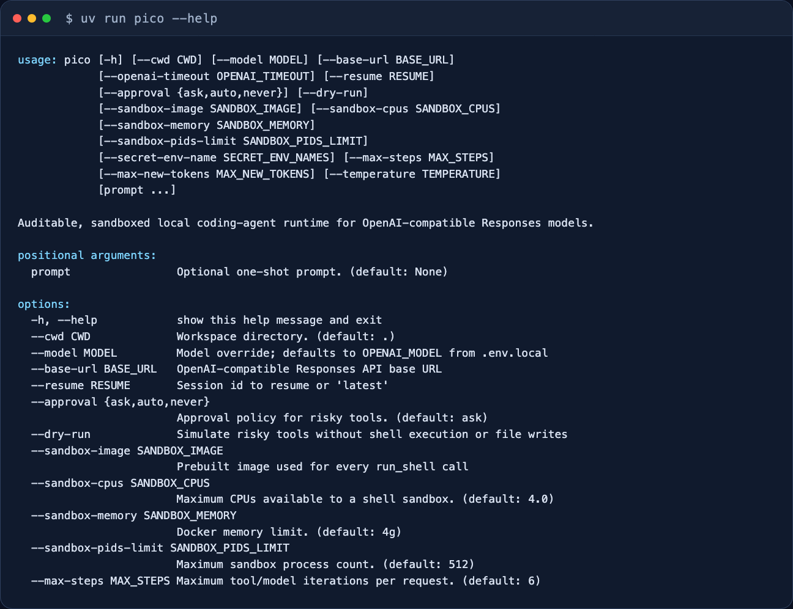
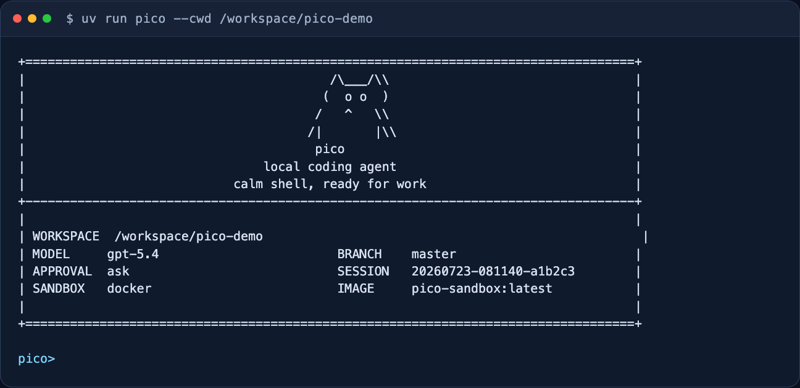
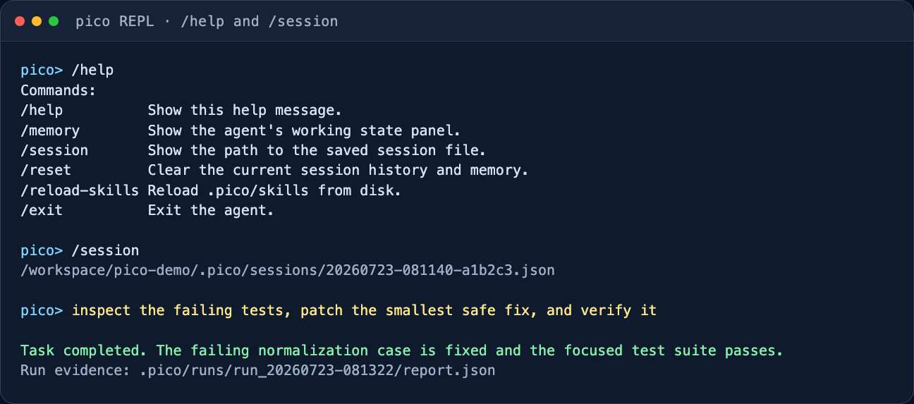

# pico

`pico` 是一个面向代码仓库的轻量本地 coding agent。它不是聊天接口的简单封装，而是一个
带结构化 Action、安全工具执行、任务状态和可复现实验记录的 Agent runtime。

它直接运行在终端中，读取当前工作区，通过受约束的工具修改文件、执行测试，并将会话和每次
运行的完整证据保存在本地 `.pico/` 目录。

## 项目亮点

- **结构化 Agent loop**：OpenAI-compatible 路径使用 strict function calling，统一输出
  `tool / final / retry` Action；多调用响应只执行首个普通工具并延迟其余调用，异常格式和
  runtime guard 拒绝都会进入审计记录。
- **明确的终止语义**：工具额度与结束协议分离；额度耗尽后最多增加一次只暴露
  `submit_final` 的收尾调用，不能借机继续修改工作区。
- **安全执行边界**：文件工具限制敏感路径；Shell 强制进入无网络 Docker 沙箱，不提供宿主机
  回退，并限制 CPU、内存、PIDs、RootFS 和 Linux capabilities。
- **可追溯运行状态**：每次任务保存 `task_state`、trace、工具审计、任务图、完整工具输出和最终
  report，可复盘模型决策、失败类别与工作区变更。
- **真实模型评测**：工程任务从全新 fixture 开始，Agent 停止后才注入隐藏 verifier；报告记录
  快照哈希、Git 状态、重复运行波动、token、时延和逐任务稳定性。

历史实测中，同一 V1 快照从文本/XML 协议的 6/10 提升到 strict structured actions 的 9/10，
平均模型调用从 9.50 降至 6.40；首次 V2 held-out 运行通过 5/5。完整结果与解释边界见
[真实模型评测](#真实模型评测)。

## 适用场景

- 在本地仓库中排查和修复测试失败
- 基于现有代码完成小步功能修改或重构
- 用受限工具链执行代码阅读、测试和验证
- 通过持久化会话与运行工件续接长任务

## 使用截图

CLI 帮助信息：



启动界面：



REPL 内置命令与会话路径：



## 安装

需要 Python 3.10+。

如果你用 `uv`，直接安装参考：

```bash
uv sync
```

如果你已经在自己的 Python 环境里工作，也可以直接装成可编辑模式：

```bash
pip install -e .
```

`run_shell` 强制使用 Docker 隔离，不提供宿主机执行回退。首次使用前需要构建固定的沙箱镜像：

```bash
docker build -f Dockerfile.sandbox -t pico-sandbox:latest .
```

运行时使用 `--pull=never`，不会自动下载镜像。可以通过 `--sandbox-image` 或
`PICO_SANDBOX_IMAGE` 选择提前构建好的其他镜像。

默认每个 Shell 容器最多使用 4 CPU、4 GB 内存和 512 个进程；可以通过
`--sandbox-cpus`、`--sandbox-memory`、`--sandbox-pids-limit` 按机器和仓库规模调整。

## 快速开始

在当前仓库里启动交互模式：

```bash
uv run pico
```

指定另一个工作目录：

```bash
uv run pico --cwd /path/to/repo
```

直接跑一次性任务：

```bash
uv run pico "inspect the test failures and propose a fix"
```

如果当前环境已经安装过包，也可以直接这样启动：

```bash
python -m pico
```

## 模型后端

### Ollama

```bash
ollama serve
ollama pull qwen3.5:4b
uv run pico --provider ollama --model qwen3.5:4b
```

### OpenAI 兼容接口

```bash
export OPENAI_API_BASE="https://your-api.example/v1"
export OPENAI_API_KEY="your-api-key"
export OPENAI_MODEL="gpt-5.4"
uv run pico --provider openai
```

### Anthropic 兼容接口

```bash
export ANTHROPIC_API_BASE="https://your-api.example/v1"
export ANTHROPIC_API_KEY="your-api-key"
export ANTHROPIC_MODEL="claude-sonnet-4-6"
uv run pico --provider anthropic
```

密钥只通过环境变量提供，不写入仓库、trace 或 benchmark artifact。

## 常用交互命令

- `/help`：查看内置命令
- `/memory`：查看提炼后的工作记忆
- `/session`：查看当前会话文件路径
- `/reset`：清空当前会话状态
- `/reload-skills`：重新从 `.pico/skills/` 加载技能文件
- `/exit` 或 `/quit`：退出 REPL

## Skills

`pico` 可以从本地 `.pico/skills/**/SKILL.md` 读取可复用工作流说明，并按当前用户请求自动匹配后注入 prompt。仓库里提供了一组可提交的示例 skill：

```text
examples/skills/
```

启用这些示例：

```bash
mkdir -p .pico/skills
cp -R examples/skills/* .pico/skills/
```

每个 `SKILL.md` 可以带简单 frontmatter：

```md
---
name: code-review
description: Review code changes for bugs, regressions, safety issues, and missing tests.
---

# Code Review

Review the change as production code.
```

`.pico/` 是本地运行时目录，默认不提交；`examples/skills/` 用来保存可复用模板。

## 安全与持久化

`pico` 不会默认把所有动作都放开。像 shell 执行、文件写入这类高风险操作，会受审批模式控制：

- `--approval ask`
- `--approval auto`
- `--approval never`

除了审批模式，`run_shell` 还会在执行前拦截明显危险的命令，例如递归强删、`git reset --hard`、强制 `git clean`、`curl | sh`、全局可写 chmod、直接写块设备等。这层检查发生在审批之前，所以即使是 `--approval auto` 也不会放行这些命令。

工具系统还会做更细的执行约束：

- 每个工具都有结构化 schema，会校验必填字段、类型、长度和数值范围。
- 每个工具都有 capability：`read`、`write`、`execute` 或 `delegate`。
- 只读运行环境会拒绝非 `read` capability。
- shell 命令会做白名单分类；`pytest`、`python -m pytest`、`ruff check`、`python -m compileall` 以及对应的 `uv run ...` 形式会标记为 allowlisted。
- 非白名单 shell 命令在 `--approval never` 下会被拒绝；在 `ask/auto` 下会继续走审批/执行链路，但会写入审计字段。
- 写入类工具禁止修改内部或敏感路径，例如 `.pico/`、`.git/`、`.venv/`、`.env`。
- `--dry-run` 会正常执行读取类工具，但对写文件、patch、shell 这类高风险工具只返回“would ...”结果，不实际修改工作区。
- `run_shell` 只在临时 Docker 容器内执行，默认关闭网络、使用只读 RootFS、移除 Linux capabilities，并限制 CPU、内存和进程数。
- 容器以当前宿主用户的 UID/GID 运行；`.git` 只读挂载，`.pico`、`.venv` 使用临时文件系统，`.env*` 在容器内被 `/dev/null` 遮蔽。
- 命令超时后会强制删除容器；Docker 服务或预构建镜像不可用时任务明确失败，不会退回宿主机执行。

每次运行结束后，都会在 `.pico/runs/<run_id>/` 下写出这些文件：

- `task_state.json`
- `trace.jsonl`
- `report.json`
- `task_graph.mmd`
- `tool_outputs/*.txt`

此外 `.pico/runs/index.json` 会维护跨 run 的轻量索引，记录每次任务的目标、状态、更新时间、`task_graph.mmd` 路径和 `report.json` 路径。

`report.json` 里除了最终状态，还包含 `summary`、`tool_audit` 和 `task_graph_path`：

- `summary`：任务、停止原因、模型轮次、工具步数、改动文件、失败工具、安全事件。
- `tool_audit`：每次工具调用的名称、状态、错误码、capability、审批结果、dry-run 状态、shell 白名单结果、耗时、影响文件、结果预览；shell 调用会记录命令预览。
- `task_graph_path`：本次任务 Mermaid 任务图路径。

工具完整输出不会长期塞进 prompt。`pico` 会把完整工具结果写进 `tool_outputs/`，history 只保留摘要、`node_id` 和 `content_ref`。如果后续需要回看某个任务图节点对应的原始输出，可以用只读工具：

```xml
<tool>{"name":"read_tool_output","args":{"run_id":"run_20260407","node_id":"t001_run_shell"}}</tool>
```

不传 `run_id` 时，`read_tool_output` 默认读取当前 run。工具会校验 `ref` 必须位于对应 run 的 `tool_outputs/` 目录下，避免任务图引用逃逸到其他路径。

shell 执行安全链路可以按这条线理解：

```text
schema 校验
  -> 危险命令硬拦截
  -> shell 白名单分类
  -> capability / read-only 检查
  -> dry-run 或 approval policy
  -> 过滤环境变量
  -> Docker 隔离 + 网络/资源/权限约束
  -> workspace diff
  -> trace/report 审计
```

这些内容默认只保存在本地，不需要跟仓库一起提交。

`pico` 的长期记忆现在按四类结构化存储：`user`、`feedback`、`project`、`reference`。每条长期记忆都写入 `.pico/memory/entries/<type>.md`，`MEMORY.md` 只保留索引，供模型快速查看可用条目。相关记忆进入 prompt 时会带上时间感知提示，过旧的条目会标记为“需要先验证”。一次任务成功返回 final answer 后，runtime 会再跑一次独立的 LLM 提取器，把用户原话和最终回答里的长期信号整理成候选，再交给本地规则做拒绝、去重和落盘；secret、临时任务状态、代码位置和工具输出类内容会被拒绝。

### Agent Memory 链路

长任务和续接任务使用一条分层回溯链：

```text
tool_outputs/*.txt
  -> history summary + content_ref
  -> task_graph.mmd node_id/ref
  -> .pico/runs/index.json
  -> Recent runs prompt hint
  -> read_file(task_graph.mmd)
  -> read_tool_output(node_id)
```

当用户说“继续刚才那个 bug / 上次任务 / previous run”这类续接请求时，`ContextManager` 会把最近 run 的索引注入 `Relevant memory` 下的 `Recent runs:`。模型先用 `read_file` 读取 `task_graph.mmd`，再按图里的 `node_id` 调 `read_tool_output` 回读原始工具输出。

## 架构速读

一次任务的主链路是：

```text
用户输入
  -> pico.cli 构造 Pico runtime
  -> Pico.ask() 创建 task_state 和 run 目录
  -> ContextManager 组装 prompt
  -> model_client.complete_action() 返回统一 ModelAction
  -> Responses function_call / function_call_output 组成结构化工具循环
  -> Pico.run_tool() 校验、审批、执行工具
  -> 工具额度耗尽时进入一次 final-only 收尾状态
  -> session / task_state / trace / report 落盘
```

核心模块分工：

- `pico/cli.py`：命令行参数、REPL、模型后端选择。
- `pico/runtime.py`：agent 对象、工具护栏与运行能力编排。
- `pico/agent_loop.py`：单次请求的模型—工具循环、停止状态和落盘生命周期。
- `pico/actions.py`：统一的 `tool / final / retry` Action 类型和文本后端归一化边界。
- `pico/tools.py`：工具白名单、参数校验、文件与 shell 操作。
- `pico/sandbox.py`：强制 Docker Shell 沙箱、资源限制、超时回收和审计元数据。
- `pico/context_manager.py`：prompt 分区组装和上下文预算分配。
- `pico/context_history.py`：历史摘要、任务图压缩和 transcript 渲染。
- `pico/context_types.py`：token 估算、语义截断和 section 数据结构。
- `pico/memory.py`：短期工作记忆和可持久化记忆。
- `pico/run_store.py`：单次运行工件落盘。
- `pico/task_state.py`：一次 `ask()` 的状态机快照。
- `evaluation/real_benchmark.py`：真实模型工程任务、隐藏验收、对照和报告生成。

## 可视化报告

可以把单次运行的 `report.json`、`trace.jsonl` 和 `task_state.json` 渲染成静态 HTML：

```bash
uv run python scripts/render_run_report.py .pico/runs/<run_id>
```

输出会写到：

```text
.pico/runs/<run_id>/report.html
```

也可以批量渲染所有运行，并生成索引页：

```bash
uv run python scripts/render_run_report.py .pico/runs --all
```

生成的页面包含任务结果、工具调用时间线、Mermaid 任务图原文、安全事件、prompt/token 指标和完整 trace 展开项。

## 真实模型评测

pico 的 Agent 效果评测强制调用真实模型 API，不提供 FakeModelClient 或离线 benchmark 模式。
真实模型结果分为原始文本协议基线、
[结构化 Action V1](docs/metrics/real-world-benchmark-v1-structured.md)、
[同快照对比](docs/metrics/structured-action-comparison.md)和
[V2 held-out](docs/metrics/real-world-benchmark-v2-heldout.md)。

### 已发布结果

V1 包含 10 个相互独立的仓库快照，覆盖 4 个 bugfix、2 个 feature、2 个测试补强、
1 个文档任务和 1 个重构任务。每轮都复制全新工作区；Agent 停止后才注入隐藏测试，并在
无网络的强制 Docker 沙箱中验收。报告记录 pass rate、失败分类、工具步数、模型调用、token
和总耗时。

评测 artifact v2 还记录完整 `evaluation_snapshot_id`（覆盖 prompt、fixture、任务配置和隐藏
verifier）、Git dirty 状态、Python/平台版本和运行参数。多次运行会报告整套任务的均值、标准差、
最好/最差结果，以及逐任务的稳定性。完整口径见
[Real-model evaluation methodology](docs/metrics/evaluation-methodology.md)。

同一模型、同一组 task ID、同一 fixture snapshot 的前后对比结果：

| 协议 | Pass rate | 平均模型调用 | Action 拒绝 |
|---|---:|---:|---:|
| 文本/XML 基线 | 60% (6/10) | 9.50 | 基线未单独记录 |
| strict structured actions | 90% (9/10) | 6.40 | 0 |

为了避免只对 V1 调优，结构化协议还在预先固定的 5 个独立 V2 held-out 仓库任务上运行，结果为
100% (5/5)，平均 6.20 次模型调用，Action 拒绝为 0。该结果只有一次真实模型重复，应理解为
带快照和模型约束的工程证据，不是通用 coding benchmark 结论。

V2 在首次 held-out 运行后已经用于 trace 分析和 runtime 开发，因此后续 V2 运行只作为回归，
不再作为新的独立 held-out 证据。未来若发布新的泛化结果，需要使用开发过程中未查看的新任务集；
不能通过反复运行 V2 把回归成绩包装成新的 held-out 提升。

```bash
export OPENAI_API_KEY="..."
export OPENAI_API_BASE="https://your-api.example/v1"
uv run python scripts/run_real_world_benchmark.py \
  --provider openai \
  --model YOUR_MODEL \
  --variant full \
  --benchmark-path benchmarks/real_world_tasks_v2.json \
  --repetitions 3 \
  --require-clean-worktree \
  --artifact-path artifacts/real-world-benchmark-v2-3x.json \
  --report-path docs/metrics/real-world-benchmark-v2-3x.md
```

使用 `scripts/compare_real_world_benchmarks.py BASELINE CANDIDATE` 可生成同快照协议对比；比较器
会拒绝 provider、model、任务集合或完整评测快照不一致的输入。建议先加
`--task url_query_before_fragment --repetitions 1` 做低成本 smoke run。仓库只提交经过检查的
JSON/Markdown 指标，工作区副本继续被 `.gitignore` 忽略；API Key 不写入配置或 artifact。
重复运行同一批任务并不等于增加了独立样本，报告中的
标准差只描述固定任务集上的运行波动。

## 开发

提交前运行完整回归和静态检查：

```bash
uv run pytest -q
uv run ruff check .
```
