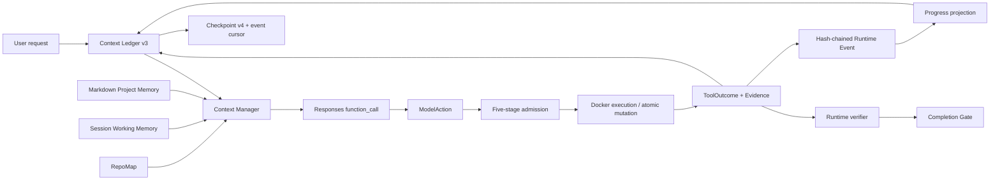

# Pico Agent Runtime

Pico uses one OpenAI-compatible Responses protocol. The model proposes exactly one native
function action; the Runtime owns authority and state.

## Invariants

- A tool result must match the single pending call ID.
- Compaction covers an exact active prefix and never splits a call/result pair.
- Compaction commits only when ledger generation, active digest and Workspace snapshot remain unchanged.
- Current request and output reserve are never clipped to make history fit.
- Large tool output becomes an artifact reference; the redacted full output remains digest-verifiable.
- Tool calls pass Registry, Surface, Schema, Policy and Approval in order.
- `write_file` and `patch_file` commit only against an observed SHA-256 revision.
- Model-requested commands never execute in a host shell; inspect/verify Docker profiles have no network and read-only root and Workspace filesystems.
- Runtime events are strict, append-only, fsynced and hash-chained; operation receipts share this single event source.
- An interrupted operation becomes unknown/partial and is never replayed as an external side effect.
- Repeated failures and no-new-evidence runs produce persisted repair/replan/stop decisions.
- A checkpoint resumes only when Session, Checkpoint and Context schemas, Runtime identity and Workspace content validate.
- File observations disappear when their source revision changes.
- Project-memory Markdown cards are the source of truth; generated indexes and model selections cannot invent filenames.
- Verification evidence is valid only for the exact Workspace content fingerprint.
- Completion is blocked by syntax errors, failed verification or unresolved partial/unknown effects.

## State ownership

| State | Scope | Storage | Freshness rule |
|---|---|---|---|
| Context Ledger | Run | `context.jsonl` | append-only; old entries covered, never deleted |
| Working Memory | Session | session JSON | exact file revision |
| Project Memory | Project | `memory/cards/*.md` | expiry + explicit versioned updates |
| Checkpoint | latest task | session JSON | strict schema/config/Workspace/event-cursor validation |
| Runtime Event Log | Run | `events.jsonl` | hash-chain validation + deterministic projections |
| Evidence/Report | Run | events/report/artifacts | content digest and Workspace fingerprint |

`report.json` is a terminal projection; `events.jsonl` and artifacts are the audit evidence.
